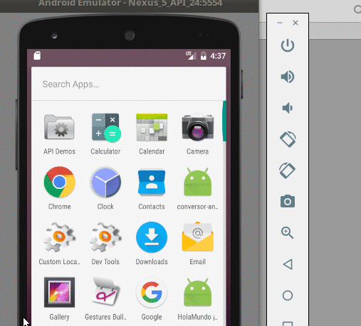

# Hola mundo REST desde un cliente Android

 

Esta es otra aplicación muy sencilla que muestra cómo consumir un servicio REST desde un cliente Android. El servicio REST devuelve un JSON que se muestra en la actividad principal.

## El proyecto
Este proyecto está generado para

* Android Studio 2.2 (Septiembre 2016)
* con Gradle 2.14.1 (el que viene con Android Studio)
* para una SDK 24 (Nougat)

## Dependencias

* **Retrofit**: es un framework que simplifica la llamada a servicios REST

